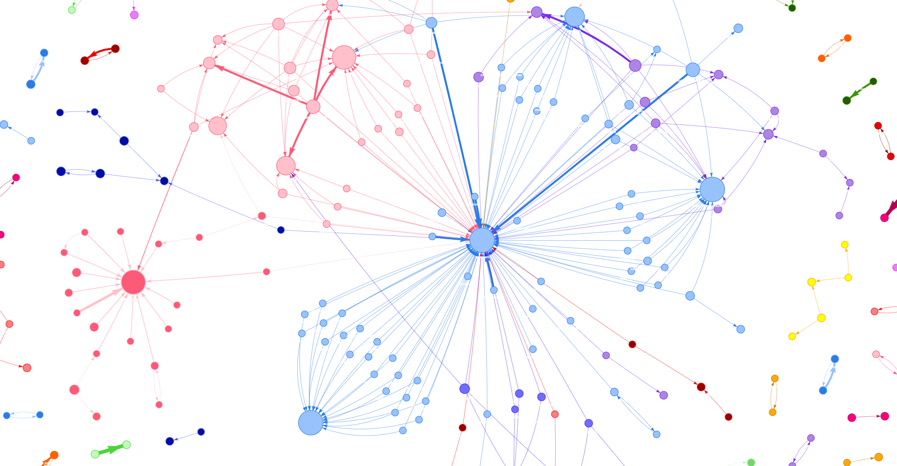

# SNA Analysis about Reshuffle

This project analyzes public discourse surrounding President Prabowo's recent cabinet reshuffle through Instagram comment networks. Using mention patterns (@username) from social media comments, we map community structures and identify echo chambers in political discussions.

## Prerequisites

- Python 3.10 or higher
- Instagram account with valid login cookies

## Result Sample

## Key Features

The analysis reveals a highly fragmented discussion landscape (0.36% network density) with distinct communities forming around different political perspectives, suggesting the presence of echo chambers in Indonesia's political social media discourse.

## Tech Stack

Python, NetworkX, Pyvis, Community Detection algorithms