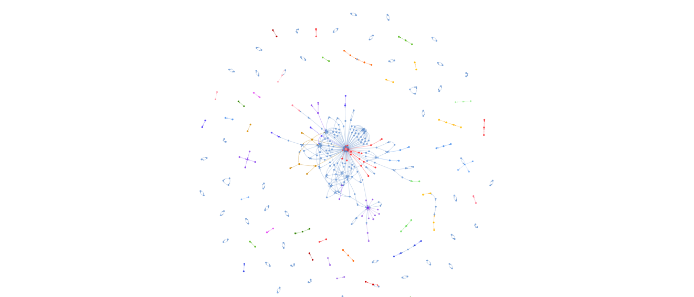

# SNA Analysis about Reshuffle

This project explores public reactions to President Prabowo’s second cabinet reshuffle (September 8, 2025) through Instagram comment networks. By analyzing mention patterns (@username), we uncover how online communities form, interact, and express sentiment around this major political event.

## Motivation

The reshuffle, which involved figures such as Sri Mulyani and Budi Arie Setiadi, triggered intense debates online. Instagram became a hotspot where supporters, critics, and neutrals voiced their opinions. Understanding this discourse provides valuable insight into how political narratives spread and how echo chambers shape public opinion.

## Prerequisites

- Python 3.10 or higher
- Instagram account with valid login cookies

## Result (Community Network)

## Key Insight

- Political discourse on Instagram shows echo chambers, where groups mostly interact within their own communities.
- Sentiment and emotion analysis helps reveal nuanced public reactions: some celebrated the reshuffle, while others expressed disappointment.
- The combination of SNA + sentiment/emotion analysis is effective for mapping how political debates evolve online.

## Tech Stack

Python, NetworkX, Pyvis, Community Detection algorithms